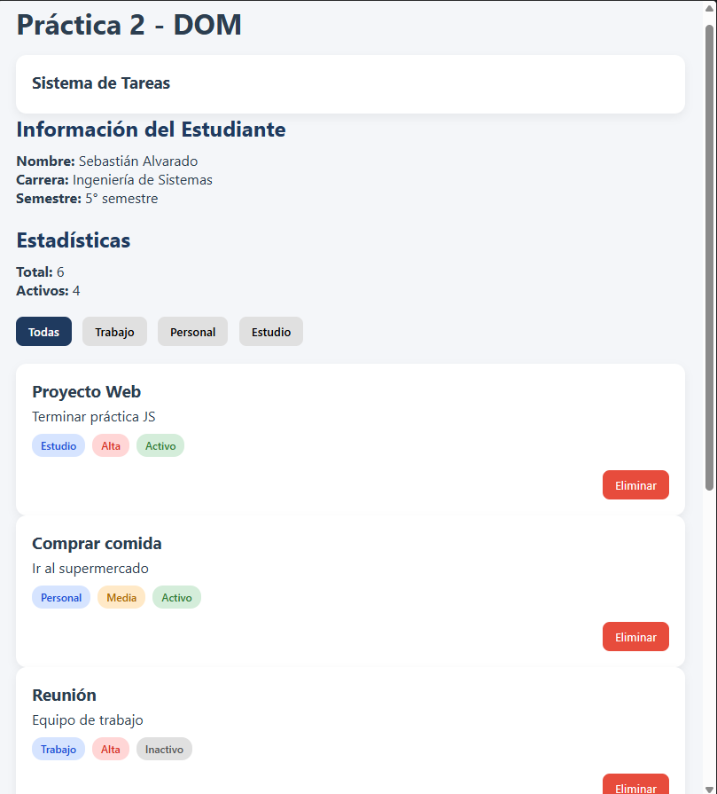
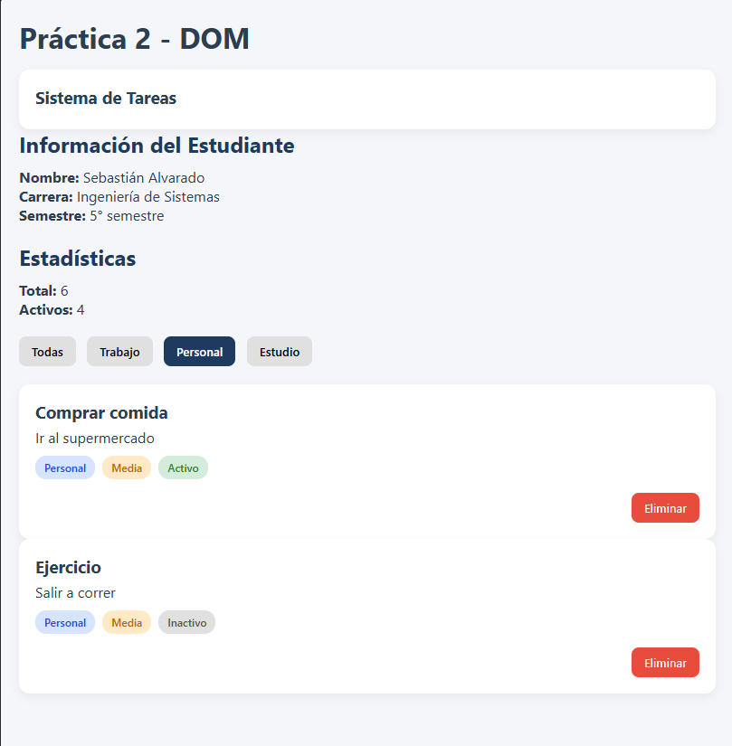

# Práctica 2 - DOM Básico

**Autor:** Sebastián Alvarado  
**GitHub:** sebmrd  
**Correo:** salvaradom1@est.ups.edu.ec

## Descripción breve de la solución
Este proyecto es una aplicación web interactiva desarrollada con HTML, CSS y JavaScript Vanilla orientada a la manipulación directa del Document Object Model (DOM). La solución implementa un sistema de gestión de tareas mediante tarjetas dinámicas. Permite leer información de un arreglo de objetos para renderizar la interfaz, filtrar los elementos por categorías específicas (Trabajo, Personal, Estudio), eliminar tareas individualmente y llevar un conteo en tiempo real de las estadísticas (elementos totales y activos).

---

## Imágenes

### Vista general de la aplicación


### Filtrado aplicado


---

## Fragmentos de código relevantes

A continuación se detallan las funciones principales que dan interactividad a la aplicación:

### 1. Renderizado de la lista
Esta función limpia el contenedor principal y utiliza un `DocumentFragment` para construir dinámicamente las tarjetas (`div.card`) de cada elemento. Esto optimiza las inserciones en el DOM antes de renderizarlas en pantalla.

```javascript
function renderizarLista(datos) {
    const contenedor = document.getElementById('contenedor-lista');
    contenedor.innerHTML = "";
    const fragment = document.createDocumentFragment();

    datos.forEach(el => {
        const card = document.createElement('div');
        card.classList.add('card');

        const titulo = document.createElement('h3');
        titulo.textContent = el.titulo;

        const descripcion = document.createElement('p');
        descripcion.textContent = el.descripcion;

        // Creación del botón de eliminar
        const btnEliminar = document.createElement('button');
        btnEliminar.textContent = 'Eliminar';
        btnEliminar.classList.add('btn-eliminar');
        btnEliminar.addEventListener('click', () => {
            eliminarElemento(el.id);
        });

        // (Se omiten fragmentos de creación de badges para brevedad)

        card.appendChild(titulo);
        card.appendChild(descripcion);
        // ... se añaden los contenedores de badges
        
        const acciones = document.createElement('div');
        acciones.classList.add('card-actions');
        acciones.appendChild(btnEliminar);
        card.appendChild(acciones);

        fragment.appendChild(card);
    });

    contenedor.appendChild(fragment);
    actualizarEstadisticas();
}
```

## 2. Eliminación de elementos

Esta función recibe el `id` de un elemento, busca su índice dentro del arreglo principal `elementos` mediante `findIndex` y lo elimina usando `splice()`. Finalmente, vuelve a invocar el renderizado para actualizar la vista.

```javascript
function eliminarElemento(id) {
    const index = elementos.findIndex(el => el.id === id);
    if (index !== -1) {
        elementos.splice(index, 1);
        renderizarLista(elementos);
    }
}
```

## 3. Filtrado

El sistema de filtros añade *event listeners* a los botones de categoría. Al hacer clic, se actualiza la clase visual activa y se crea un nuevo arreglo `filtrados` utilizando el método `filter()`, el cual se envía a la función de renderizado.

```javascript
function inicializarFiltros() {
    const botones = document.querySelectorAll('.btn-filtro');
    
    botones.forEach(btn => {
        btn.addEventListener('click', () => {
            const categoria = btn.dataset.categoria;
            
            // Actualizar clases de botones
            document.querySelectorAll('.btn-filtro').forEach(b => b.classList.remove('btn-filtro-activo'));
            btn.classList.add('btn-filtro-activo');

            // Lógica de filtrado
            if (categoria === 'todas') {
                renderizarLista(elementos);
            } else {
                const filtrados = elementos.filter(e => e.categoria === categoria);
                renderizarLista(filtrados);
            }
        });
    });
}
```
