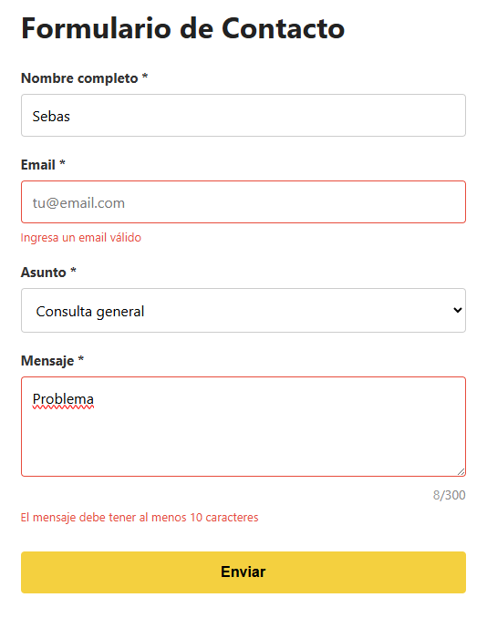
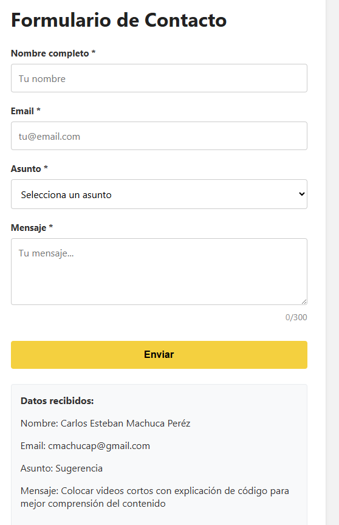
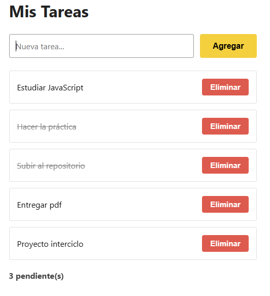
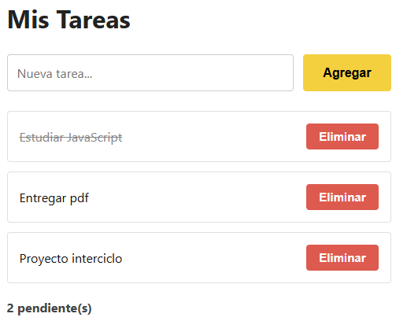
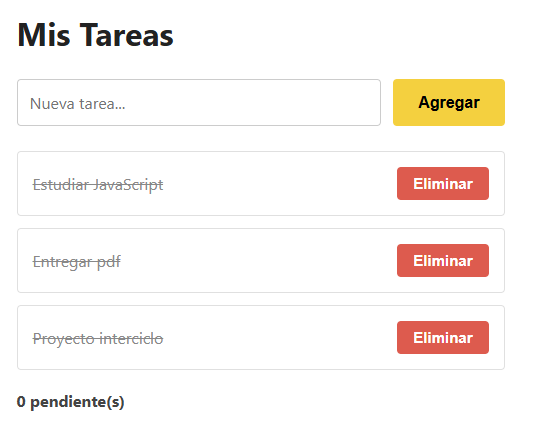

# Práctica 3 - Eventos en JavaScript

**Autor:** Sebastián Alvarado  
**GitHub:** sebmrd  
**Correo:** salvaradom1@est.ups.edu.ec

---

### Descripción breve de la solución implementada
El proyecto consiste en una página web interactiva desarrollada con **HTML, CSS y Vanilla JavaScript**. Se divide en dos módulos principales:

* **Formulario de Contacto:** Cuenta con validación dinámica de campos (nombre, email, asunto y longitud de mensaje).
* **Gestor de Tareas:** Permite al usuario añadir, marcar como completadas o eliminar tareas, actualizando un contador de pendientes en tiempo real.

### Fragmentos de código de las funciones principales
Se ha utilizado manipulación del DOM y manejo de eventos avanzados, cuyos detalles se encuentran en la sección de código destacado.

### Imágenes insertadas correctamente desde `/assets`
Las evidencias del funcionamiento visual de la solución se encuentran detalladas en la sección de capturas.

---

## 8.2.1 Código destacado

#### Validación de formulario con `preventDefault()`
Se intercepta el evento de envío para evitar la recarga de la página y asegurar que los datos solo se procesen si todos los campos cumplen los requisitos.

```javascript
formulario.addEventListener('submit', (e) => {
    e.preventDefault();

    const nombreValido = validarNombre();
    const emailValido = validarEmail();
    const asuntoValido = validarAsunto();
    const mensajeValido = validarMensaje();

    if (nombreValido && emailValido && asuntoValido && mensajeValido) {
        mostrarResultado();
        resetearFormulario();
        return;
    }
    
    if (!nombreValido) { inputNombre.focus(); return; }
    if (!emailValido) { inputEmail.focus(); return; }
    if (!asuntoValido) { selectAsunto.focus(); return; }
    textMensaje.focus();
});
```

#### Event delegation en la lista de tareas
Se asigna un único *event listener* al contenedor padre (`#lista-tareas`) para gestionar de forma eficiente los clics de los botones hijos (eliminar y alternar estado), mejorando el rendimiento mediante el uso de atributos `data-action`.

```javascript
listaTareas.addEventListener('click', (e) => {
    const action = e.target.dataset.action;
    if (!action) {
        return;
    }

    const item = e.target.closest('li');
    if (!item || !item.dataset.id) {
        return;
    }

    const id = Number(item.dataset.id);

    if (action === 'eliminar') {
        tareas = tareas.filter((tarea) => tarea.id !== id);
        renderizarTareas();
        return;
    }

    if (action === 'toggle') {
        const tarea = tareas.find((itemTarea) => itemTarea.id === id);
        if (tarea) {
            tarea.completada = !tarea.completada;
            renderizarTareas();
        }
    }
});
```

#### Atajo de teclado con Ctrl+Enter
Se implementa un evento global en el documento que permite enviar el formulario de manera rápida utilizando una combinación de teclas, disparando el evento de validación nativo con `requestSubmit()`.

```javascript
document.addEventListener('keydown', (e) => {
    if (e.ctrlKey && e.key === 'Enter') {
        e.preventDefault();
        formulario.requestSubmit();
    }
});
```

---

#### Capturas

## Validación



## Formuladrio Enviado



## Delegación



## Contador



## Tareas Completadas



---