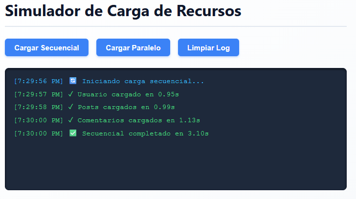
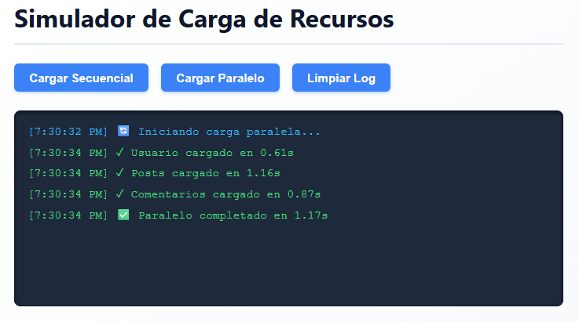
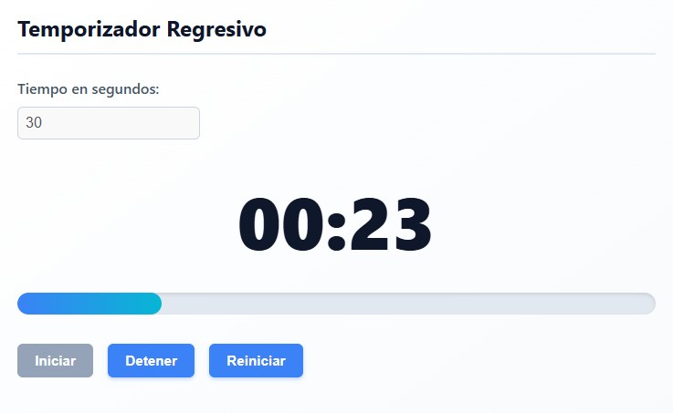
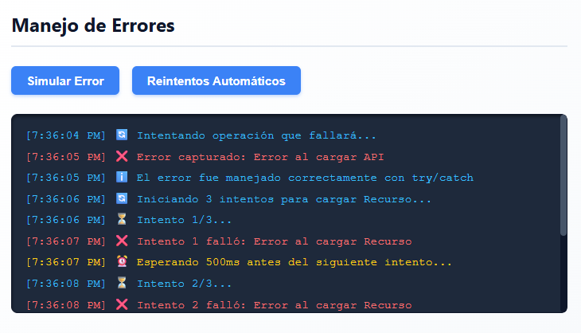

# Práctica 5 - Asincronía en JavaScript

**Autor:** Sebastián Alvarado  
**GitHub:** sebmrd  
**Correo:** salvaradom1@est.ups.edu.ec

---

## Descripción del Simulador Implementado
Este proyecto es un simulador interactivo diseñado para demostrar y comparar visualmente los conceptos clave de la asincronía en JavaScript. La aplicación consta de tres módulos principales:
1. **Simulador de Carga de Recursos:** Permite visualizar la diferencia de rendimiento entre resolver múltiples promesas de forma secuencial versus hacerlo en paralelo.
2. **Temporizador Regresivo:** Implementa el manejo del tiempo a través de la web API, controlando intervalos de actualización en la interfaz gráfica con animaciones de estado (alertas).
3. **Manejo de Errores:** Demuestra la captura controlada de excepciones asíncronas mediante bloques `try/catch` y algoritmos de reintento con *backoff* exponencial.

---

## Análisis de Rendimiento: Carga Secuencial vs. Paralela
Al ejecutar las pruebas en el simulador, se observa una diferencia drástica en los tiempos de respuesta:

* **Carga Secuencial:** El tiempo total de ejecución es igual a la suma de los tiempos individuales de cada petición (TiempoTotal = Petición1 + Petición2 + Petición3). El hilo de ejecución se bloquea en cada `await` hasta que la promesa actual se resuelve, generando un cuello de botella innecesario cuando las tareas son independientes.
* **Carga Paralela:** El tiempo total de ejecución equivale aproximadamente al tiempo de la petición más lenta (TiempoTotal ≈ max(Petición1, Petición2, Petición3)). Al disparar todas las promesas simultáneamente y esperar su resolución conjunta, se optimiza el uso de la red y el procesador.

**Conclusión:** Para peticiones que no dependen unas de otras (como cargar usuarios, posts y comentarios simultáneamente), `Promise.all` ofrece una optimización de entre el 50% y 70% en el tiempo de carga, mejorando significativamente la experiencia del usuario final.

---

## Código Destacado

A continuación, se presentan los fragmentos clave que hacen posible la lógica asíncrona de la aplicación:

### 1. Función que retorna promesa con `setTimeout`
Simula la latencia de una red utilizando un retraso aleatorio y permitiendo forzar fallos para pruebas.

```javascript
function simularPeticion(nombre, tiempoMin = 500, tiempoMax = 2000, fallar = false) {
  return new Promise((resolve, reject) => {
    const tiempoDelay = Math.floor(Math.random() * (tiempoMax - tiempoMin + 1)) + tiempoMin;
    setTimeout(() => {
      if (fallar) {
        reject(new Error(`Error al cargar ${nombre}`));
      } else {
        resolve({ nombre, tiempo: tiempoDelay, timestamp: new Date().toLocaleTimeString() });
      }
    }, tiempoDelay);
  });
}
```

## 2. Carga Secuencial con `await` consecutivos
Demuestra cómo el código espera a que finalice una petición antes de iniciar la siguiente.

```javascript
async function cargarSecuencial() {
  try {
    const usuario = await simularPeticion('Usuario', 500, 1000);
    const posts = await simularPeticion('Posts', 700, 1500);
    const comentarios = await simularPeticion('Comentarios', 600, 1200);
    // El tiempo total es la suma de los tres
  } catch (error) {
    mostrarLog(`❌ Error: ${error.message}`, 'error');
  }
}
```

### 3. Carga Paralela con `Promise.all`
Ejecuta las promesas de forma concurrente, reduciendo drásticamente el tiempo de espera.

```javascript
async function cargarParalelo() {
  try {
    const promesas = [
      simularPeticion('Usuario', 500, 1000),
      simularPeticion('Posts', 700, 1500),
      simularPeticion('Comentarios', 600, 1200)
    ];
    const resultadosPromesas = await Promise.all(promesas);
    // El tiempo total es el de la promesa más lenta
  } catch (error) {
    mostrarLog(`❌ Error: ${error.message}`, 'error');
  }
}
```

### 4. Manejo de Errores con `try/catch`
Captura excepciones de promesas rechazadas sin romper el flujo de la aplicación.

```javascript
async function simularError() {
  try {
    await simularPeticion('API', 500, 1000, true); // fallar = true
  } catch (error) {
    mostrarLogError(`❌ Error capturado: ${error.message}`, 'error');
    mostrarLogError('ℹ️ El error fue manejado correctamente con try/catch', 'info');
  }
}
```

### 5. Temporizador con `setInterval`
Ejecuta lógica recurrente cada segundo para actualizar el DOM y controla su propia destrucción.

```javascript
function iniciar() {
  if (intervaloId) return; // Evita múltiples intervalos
  
  intervaloId = setInterval(() => {
    tiempoRestante--;
    actualizarDisplay();

    if (tiempoRestante <= 0) {
      detener(); // Utiliza clearInterval() internamente
      alert('⏰ ¡Tiempo terminado!');
    }
  }, 1000);
}
```

---

## Capturas

### Comparativa: Secuencial vs. Paralelo





### Temporizador en Funcionamiento



### Manejo de Errores



---