# Práctica 8 - Gestor de Posts con Fetch API

**Autor:** Sebastián Alvarado  
**GitHub:** sebmrd  
**Correo:** salvaradom1@est.ups.edu.ec

---

Este proyecto es una aplicación web de una sola página (SPA) que interactúa con la API REST falsa `JSONPlaceholder`. Demuestra el uso de peticiones HTTP asíncronas, manipulación dinámica del DOM y modularidad en JavaScript.

A continuación, se detallan las funcionalidades implementadas junto con sus respectivas evidencias visuales:

### 1. Datos cargados desde la API
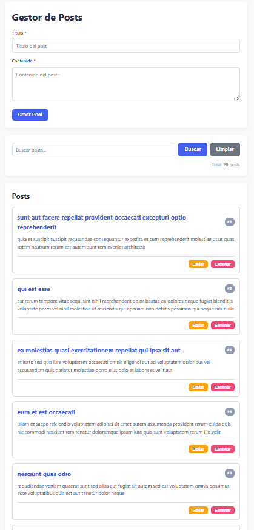

**Descripción:** Al inicializar la aplicación, se ejecuta una petición HTTP `GET` al endpoint `/posts?_limit=20`. Una vez que la promesa se resuelve, los datos en formato JSON son mapeados y renderizados dinámicamente en el DOM utilizando el componente `PostCard`, mostrando el ID, título y contenido de cada registro.

La carga inicial de datos se maneja a través de una función asíncrona (async/await) que interactúa con el endpoint /posts. Para evitar sobrecargar la vista, se implementó el parámetro de consulta ?_limit=20, optimizando el tiempo de respuesta. Los datos recibidos son almacenados en un estado global (arreglo posts) que actúa como la fuente de la verdad para la aplicación, permitiendo manipular la información en memoria sin necesidad de realizar peticiones de lectura adicionales al servidor.

### 2. Estado de carga (Spinner)

**Descripción:** Para mejorar la experiencia de usuario (UX), se implementó un indicador visual (spinner) que se adjunta al DOM justo antes de disparar la petición asíncrona. Una vez que la API responde (o falla), este elemento es removido y reemplazado por la información recibida.

Para la construcción de la interfaz, se optó por utilizar la API del DOM (document.createElement, appendChild) en lugar de inyectar plantillas de texto con innerHTML. Esta decisión arquitectónica previene vulnerabilidades de tipo XSS (Cross-Site Scripting) al sanitizar implícitamente el contenido devuelto por la API. Cada tarjeta generada encapsula su propio contexto de datos mediante atributos data- (ej. data-id), lo que facilita la identificación del nodo durante los eventos de interacción.

### 3. Crear un nuevo Post
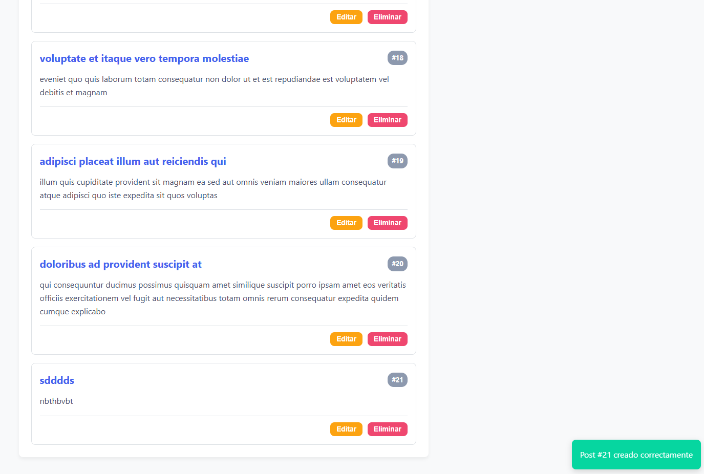

**Descripción:** El formulario captura los datos del usuario e interrumpe el evento `submit` por defecto. Se envía una petición `POST` con el payload convertido mediante `JSON.stringify()`. Al recibir la confirmación (código HTTP 201), el nuevo objeto se agrega al arreglo local mediante `.push()` y se dispara una notificación de éxito temporal en la esquina inferior.

El envío del formulario intercepta el comportamiento síncrono del navegador mediante e.preventDefault(). Los datos de los inputs se serializan utilizando JSON.stringify() para cumplir con el estándar de transmisión de la API. Dado que JSONPlaceholder es una API mock que no persiste datos y siempre devuelve el ID estático 101, se implementó una capa de lógica en el cliente que intercepta la respuesta, calcula el id máximo actual en el estado global (Math.max) y le asigna un ID dinámico correlativo. Posteriormente, el nuevo objeto se inyecta en el arreglo local usando .push() y se fuerza un re-renderizado parcial de la vista.

### 4. Actualizar un Post
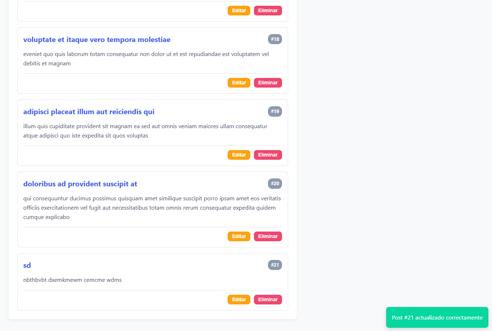

**Descripción:** Al presionar "Editar", se cargan los datos del post en el formulario. Al guardar, se ejecuta una petición `PUT` al endpoint `/posts/{id}`. Si la respuesta es exitosa, se localiza el índice del elemento en el arreglo local con `.findIndex()`, se actualizan sus valores manteniendo la sincronía con la vista, y se muestra el mensaje de éxito correspondiente.

Al editar un registro, el formulario cambia dinámicamente de modo "creación" a "edición". Tras la confirmación del servidor (código 200 OK), el cliente no realiza un recargo completo de la página. En su lugar, se localiza el nodo de datos en memoria mediante Array.prototype.findIndex(). Utilizando el spread operator (...), se crea una copia inmutable del objeto original combinada con el nuevo payload, garantizando que el estado de la aplicación se actualice de forma predecible antes de sincronizar la vista del DOM.

### 5. Eliminar un Post
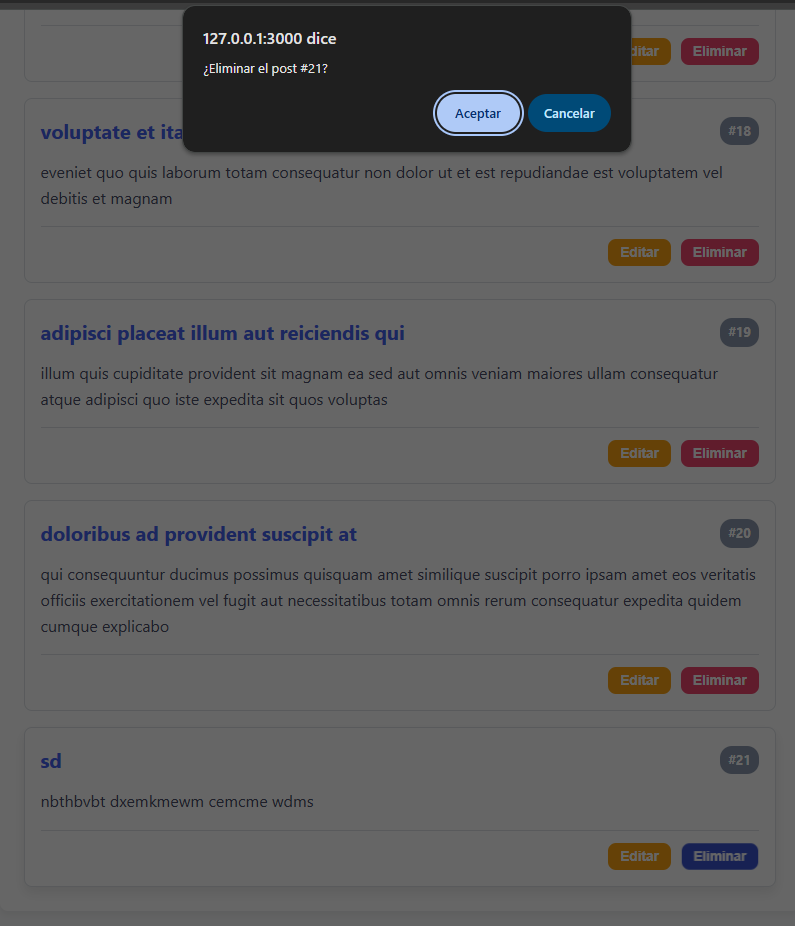
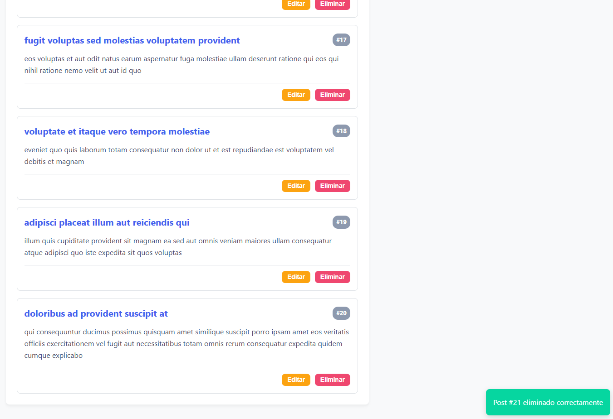

**Descripción:** La eliminación requiere un paso de seguridad mediante un cuadro de diálogo `confirm()`. Al aceptar, se lanza una petición `DELETE`. Tras el éxito de la operación, el post se retira del estado global utilizando el método de arreglo `.filter()` y se vuelve a renderizar la lista actualizada sin necesidad de recargar la página.

La operación de borrado invoca una petición HTTP con el método DELETE. Para mantener la sincronía entre el servidor y el cliente, una vez que la promesa se resuelve exitosamente, se aplica el método Array.prototype.filter() sobre el estado global para purgar el objeto en memoria. Este enfoque funcional evita mutaciones directas y operaciones costosas en el árbol del DOM, ya que el motor de renderizado simplemente vuelve a pintar la lista a partir del arreglo ya purgado.

### 6. Manejo de Errores
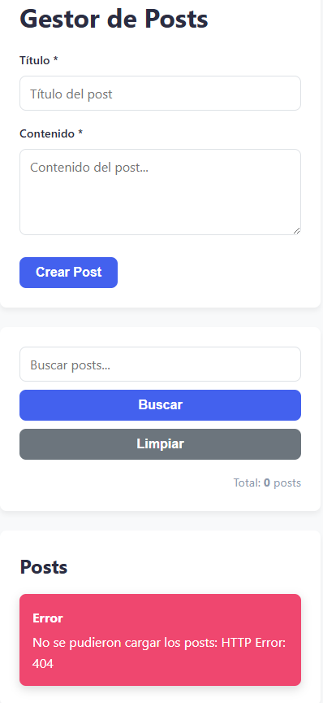

**Descripción:** Las llamadas a la API están encapsuladas en bloques `try...catch`. Se evalúa explícitamente la propiedad `response.ok` del objeto Fetch, ya que la API no arroja excepciones en errores 4xx o 5xx. Si se detecta una falla (como una URL incorrecta o caída del servidor), se lanza un `Error` personalizado que es capturado y mostrado al usuario en formato de alerta roja.

En lugar de asignar un Event Listener individual a cada botón de "Editar" o "Eliminar" (lo cual generaría fugas de memoria y requeriría reasignar eventos cada vez que la lista se actualiza), se implementó el patrón de delegación de eventos. Se colocó un único listener en el contenedor padre (#lista-posts). Cuando ocurre un evento de clic, el evento burbujea (event bubbling) hacia arriba, y el controlador verifica el dataset.action del e.target para determinar qué bloque de lógica ejecutar.

### 7. Monitoreo de Peticiones (DevTools)
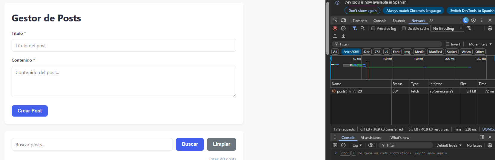

**Descripción:** En la pestaña Network de las herramientas de desarrollador se pueden observar los requests HTTP (Fetch/XHR). Aquí se evidencia el tráfico de red, los códigos de estado devueltos por el servidor y el peso/tiempo de cada transacción realizada por la aplicación.

Para cumplir con el principio DRY (Don't Repeat Yourself), la capa de red se abstrajo en un objeto literal que funciona como un servicio Singleton. El método principal request(endpoint, options) encapsula la lógica base de la función fetch(), la inyección de encabezados genéricos (Content-Type: application/json) y la validación estricta de la respuesta.

### 8. Código fuente: Servicio API
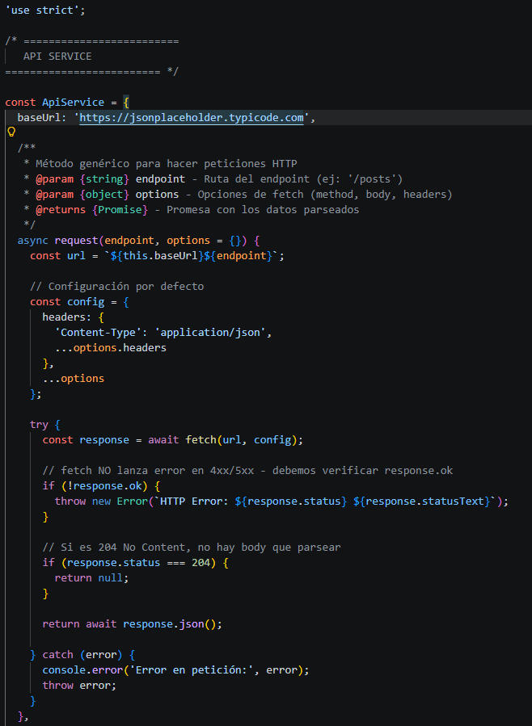
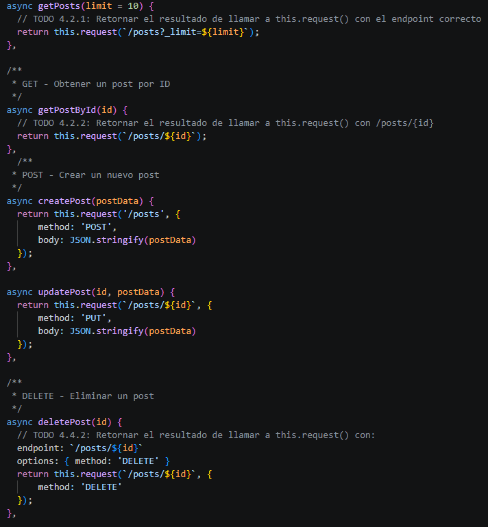
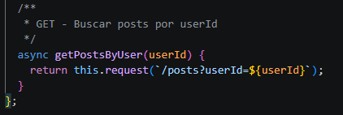

**Descripción:** Se aplicó el patrón de diseño Singleton/Módulo para centralizar todas las peticiones a la API en el objeto `ApiService`. Esto incluye un método genérico `request` que configura los encabezados (`headers`) y parsea el JSON, reduciendo la repetición de código en las funciones CRUD (`getPosts`, `createPost`, `updatePost`, `deletePost`).

Debido a la naturaleza de la Fetch API —la cual no rechaza la promesa en respuestas HTTP 4xx o 5xx— se implementó una evaluación manual de la propiedad response.ok. Si el estado HTTP indica error, la capa de red lanza un bloque throw new Error() que interrumpe el flujo de ejecución y delega el control al bloque catch del controlador principal. Este bloque captura la excepción y activa el componente UI correspondiente (alerta roja de error) mediante un setTimeout, garantizando un feedback loop claro para el usuario.

### 9. Código fuente: Componentes de UI
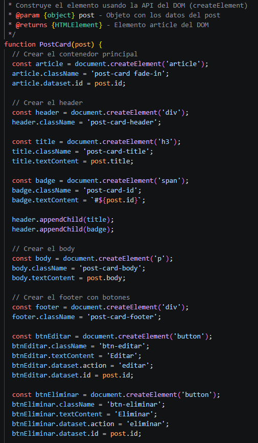
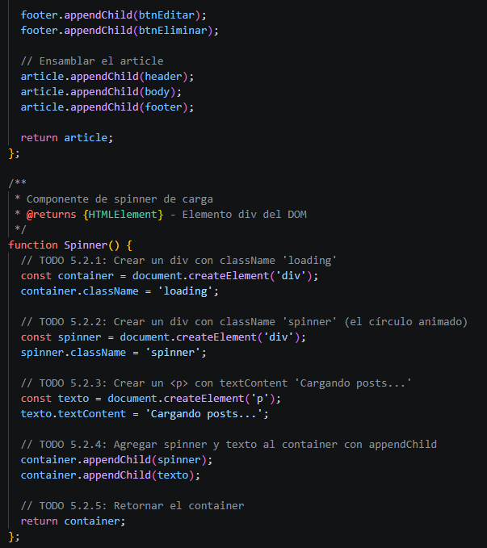
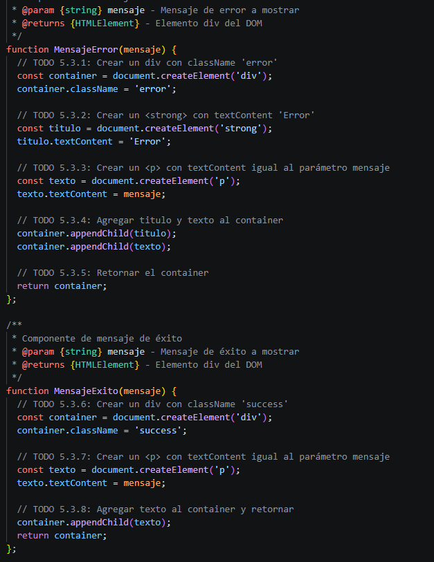
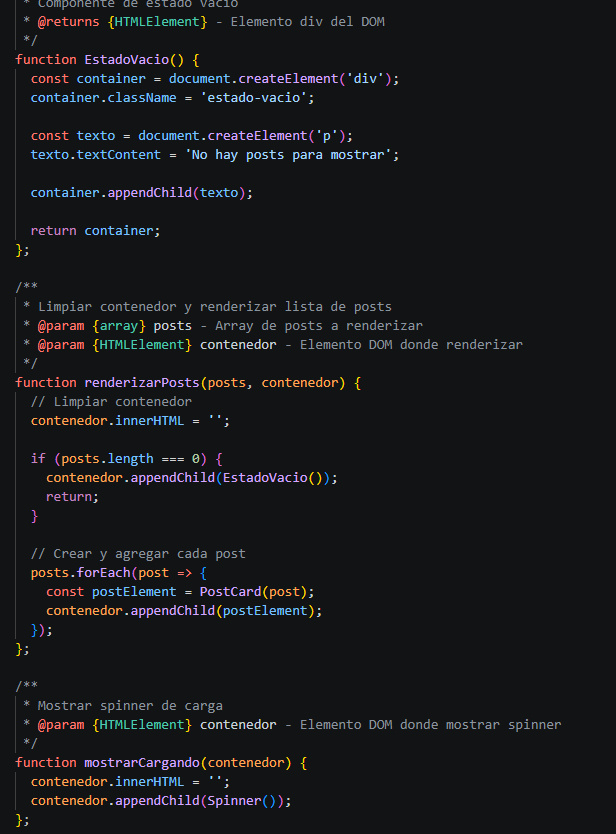
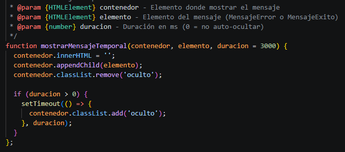

**Descripción:** La construcción de la interfaz gráfica se desacopló del archivo lógico principal. En `components.js` se generan los nodos del DOM nativamente con `document.createElement()` para optimizar el rendimiento. Esto incluye la creación de tarjetas de posts, spinners, estados vacíos y modales de retroalimentación.

La arquitectura de la interfaz de usuario sigue un enfoque modular en JavaScript puro (Vanilla JS). En lugar de depender de la inserción estática de cadenas de texto mediante innerHTML (práctica que dificulta el escalado y puede abrir brechas de seguridad), cada elemento visual se construye de manera imperativa utilizando la API nativa del DOM (document.createElement(), appendChild(), classList). Al aislar la creación de nodos en el archivo components.js (tarjetas, spinners, modales de error), se logra una clara separación de responsabilidades (Separation of Concerns). Esto permite que el archivo controlador principal (app.js) se mantenga agnóstico respecto a la estructura HTML y se enfoque exclusivamente en la lógica de negocio, el control de estado y la orquestación de eventos, promoviendo la reutilización de código.

### Conclusiones

 * Asincronía y No Bloqueo:
La implementación de la Fetch API junto con las declaraciones async/await permitió consumir servicios externos de manera fluida y no bloqueante, demostrando cómo JavaScript gestiona operaciones de entrada/salida (I/O) en el Event Loop sin congelar la interfaz de usuario.

* Resiliencia y Manejo de Excepciones:
Se comprobó la importancia de validar exhaustivamente los códigos de estado HTTP (verificando response.ok), ya que la promesa de Fetch no se rechaza por defecto ante errores de servidor (4xx o 5xx). El uso de bloques try...catch aseguró que la aplicación pudiera recuperarse de fallos y notificar al usuario correctamente.

* Optimización del DOM:
Al construir la interfaz mediante la manipulación directa de nodos y utilizar el patrón de delegación de eventos (Event Delegation), se redujo el consumo de memoria y se previnieron las fugas de memoria (memory leaks) que ocurren al reasignar eventos constantemente durante el renderizado dinámico.

* Sincronización de Estado:
El desarrollo evidenció el desafío de mantener la consistencia entre los datos del servidor (mock API) y el estado visual en el navegador. La implementación de un arreglo local funcionó como una caché eficiente que permitió reflejar acciones CRUD en la vista de forma instantánea.

### Bibliografía y Referencias

* **MDN Web Docs (Mozilla).** (s.f.). [Uso de Fetch](https://developer.mozilla.org/es/docs/Web/API/Fetch_API/Using_Fetch).
* **MDN Web Docs (Mozilla).** (s.f.). [Funciones asíncronas (async/await)](https://developer.mozilla.org/es/docs/Web/JavaScript/Reference/Statements/async_function).
* **MDN Web Docs (Mozilla).** (s.f.). [Introducción al DOM](https://developer.mozilla.org/es/docs/Web/API/Document_Object_Model/Introduction).
* **JSONPlaceholder.** (s.f.). [Free fake API for testing and prototyping](https://jsonplaceholder.typicode.com/). (Documentación oficial de la API consumida en el proyecto).