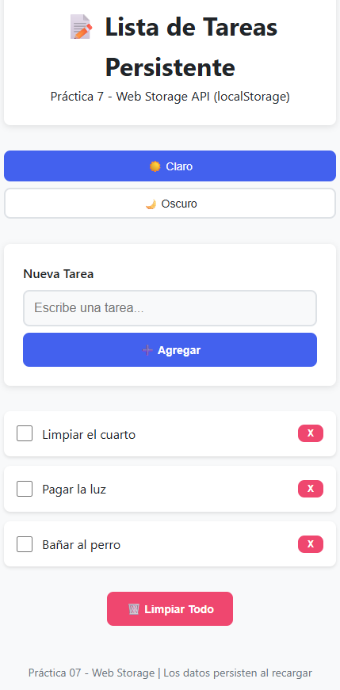
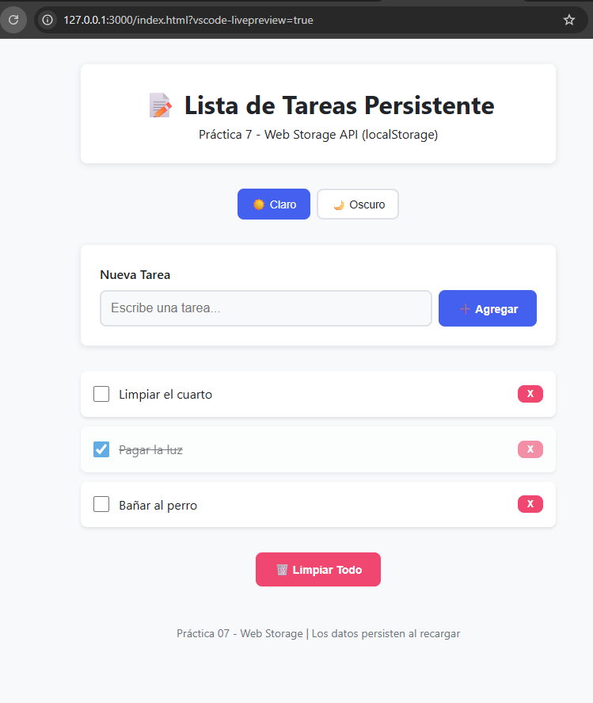
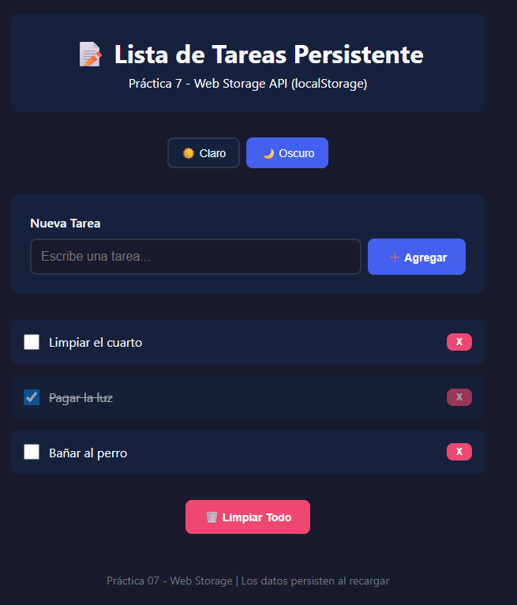
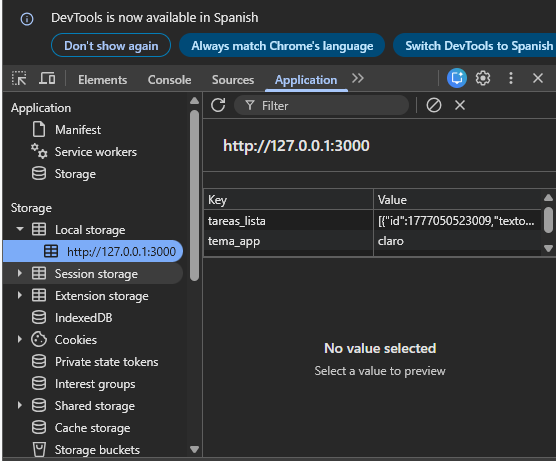
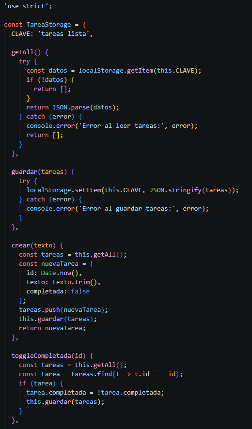
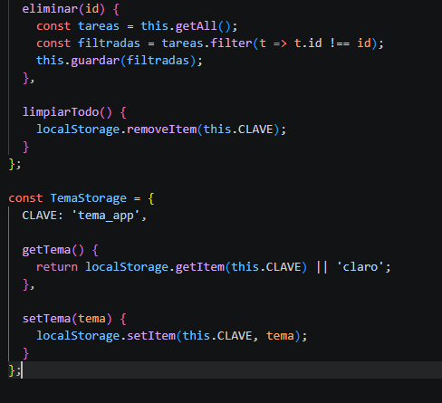
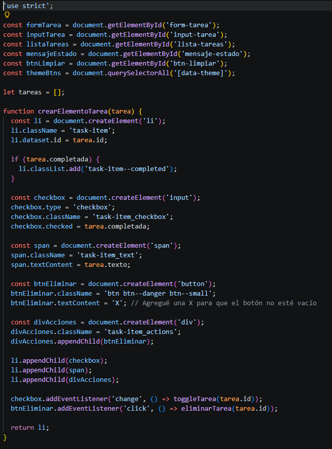
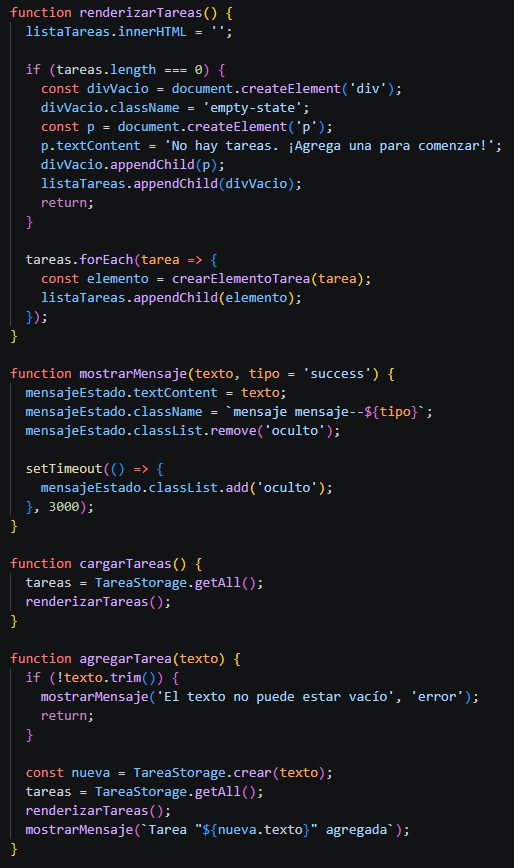
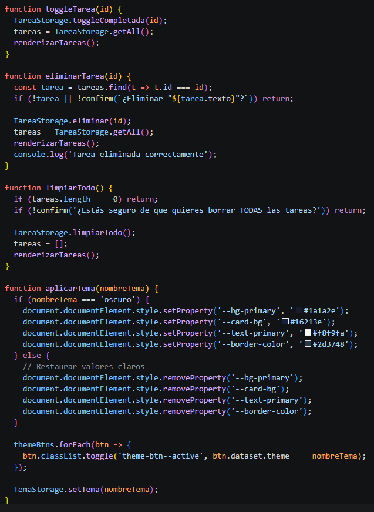
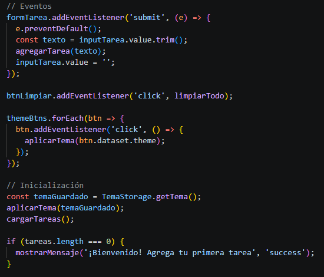

# Práctica 07 - Web Storage (Lista de Tareas)

**Autor:** Sebastián Alvarado  
**GitHub:** sebmrd  
**Correo:** salvaradom1@est.ups.edu.ec

---

## Introducción

En el desarrollo de aplicaciones web modernas, la experiencia del usuario y la retención de su información son pilares fundamentales. Tradicionalmente, la conservación del estado entre sesiones dependía de bases de datos del lado del servidor o del uso de cookies. Sin embargo, la API de Web Storage (introducida con HTML5) proporciona una solución nativa, segura y eficiente para almacenar datos estructurados directamente en el navegador del cliente.

El presente documento detalla la construcción de una aplicación interactiva de "Lista de Tareas" desarrollada con Vanilla JavaScript, HTML y CSS. El objetivo de esta práctica es implementar la interfaz localStorage para garantizar que tanto la información generada por el usuario (tareas pendientes y completadas) como sus preferencias de personalización (tema claro u oscuro) persistan de manera local. Esto permite que la aplicación sobreviva a recargas de página y cierres de ventana sin depender de un backend externo.

---

## Desarrollo

### 1. Lista con datos - Tareas creadas visibles

**Descripción:** Interfaz de la aplicación mostrando la creación de varias tareas. Se evidencia el correcto funcionamiento del renderizado del DOM, permitiendo visualizar tareas tanto en estado pendiente como completado (tachadas).

Para la visualización de las tareas, se implementó un sistema de renderizado dinámico en el cliente. En lugar de tener HTML estático, el contenedor principal de la lista (ul#lista-tareas) se actualiza mediante JavaScript interceptando el evento submit del formulario. Cada vez que se agrega una nueva tarea, se crea un nodo en el DOM utilizando document.createElement, asignándole clases CSS específicas para su maquetación. Se maneja un estado local en memoria (un array de objetos) que actúa como la "fuente de la verdad" temporal para la vista, permitiendo tachar tareas completadas mediante el toggle de una clase CSS específica (.task-item--completed).

### 2. Persistencia - Recargar página

**Descripción:** Captura tomada inmediatamente después de recargar el navegador (F5). Se verifica que la información persiste intacta; las tareas y sus estados se recuperan correctamente desde la memoria local del navegador.

La principal característica funcional de la aplicación es la persistencia de sesión. Para evitar la pérdida de información del estado local (array de tareas) tras un re-renderizado del navegador o un cierre de pestaña, se integró la API nativa de Web Storage. Específicamente, durante la inicialización de la vista (app.js), se ejecuta una función de "hidratación" (cargarTareas()) que verifica la existencia de datos previos en el almacenamiento del navegador, los extrae, reconstruye el estado local y gatilla un re-renderizado inmediato del DOM para que el usuario retome su sesión exactamente donde la dejó.

### 3. Tema oscuro - Cambio de tema aplicado

**Descripción:** Aplicación del cambio de tema mediante la modificación de variables CSS. La preferencia seleccionada ("Oscuro") se guarda en `localStorage` bajo la clave `tema_app`, manteniéndose activa incluso al recargar la página.

El sistema de cambio de temas (Claro/Oscuro) se construyó utilizando CSS Custom Properties (Variables CSS) definidas en la pseudo-clase :root. Mediante JavaScript, se intercepta el clic en los botones de tema y se inyectan nuevos valores a las variables a nivel de document.documentElement.style. Para brindar una experiencia de usuario (UX) fluida, esta preferencia de interfaz también se delega al almacenamiento local bajo la clave tema_app. Al cargar la página, un script síncrono consulta esta clave y aplica las variables correspondientes antes de pintar la vista, evitando el efecto de "parpadeo" (FOUC - Flash of Unstyled Content).

### 4. DevTools Application - Local Storage

**Descripción:** Inspección de la pestaña *Application > Local Storage* en las herramientas de desarrollador. Se confirma la existencia real de los datos guardados: la clave `tareas_lista` conteniendo el array de objetos en formato JSON stringificado, y la clave `tema_app` con el valor del tema actual.

Como se observa en el panel de Application/Storage de las DevTools, localStorage funciona estrictamente como un almacén de pares Clave-Valor (Key-Value) que solo admite cadenas de texto (strings). Para poder almacenar estructuras de datos complejas, como nuestro array de objetos de tareas (donde cada tarea contiene un id, texto y un booleano completada), se implementó un proceso de serialización. Se utiliza JSON.stringify() al guardar los datos (Write) y JSON.parse() al recuperarlos (Read), garantizando la integridad de los tipos de datos en la memoria de la aplicación.

### 5. Código - Lógica de persistencia (storage.js)

**Descripción:** Implementación del objeto `TareaStorage`. Se muestran los métodos encargados de interactuar directamente con la API de Web Storage (`getItem`, `setItem`, `removeItem`), manejando la lógica de negocio (crear, buscar, filtrar y modificar estado de las tareas) de forma independiente al DOM.

A nivel arquitectónico, se aplicó el principio de Separación de Responsabilidades (Separation of Concerns). Se creó un módulo independiente (TareaStorage) que funciona bajo un patrón similar a un Singleton o Servicio. Este objeto encapsula exclusivamente toda la lógica de acceso a datos (operaciones CRUD: Crear, Leer, Actualizar, Borrar) y el manejo de excepciones (try...catch) al interactuar con el localStorage. Esto desacopla la persistencia de la manipulación visual, haciendo que el código sea modular, más seguro y escalable.

### 6. Código - Lógica de interfaz y eventos (app.js)

**Descripción:** Implementación de la interacción con el DOM. Se muestran las funciones que capturan los eventos del usuario, actualizan la variable de estado local consultando a `TareaStorage` y ejecutan la función de renderizado para mantener la interfaz sincronizada con los datos guardados.

El archivo app.js actúa como el Controlador de la aplicación. Su función principal es orquestar la interacción entre la interfaz de usuario (DOM) y el servicio de datos (TareaStorage). Este script se encarga de asignar los Event Listeners a los elementos interactivos, capturar las entradas del usuario (inputs), invocar los métodos del servicio de persistencia y, finalmente, ejecutar la función renderizarTareas() para mantener la interfaz visual estrictamente sincronizada con los datos guardados. Adicionalmente, incluye lógica de validación básica para evitar la inyección de tareas vacías.

---

## Conclusiones

* **Eficacia del almacenamiento local:** La implementación de localStorage demostró ser una herramienta altamente robusta para mantener el estado de la aplicación en el lado del cliente, previniendo la pérdida accidental de datos y mejorando la experiencia de uso.

* **Serialización obligatoria de datos:** Dado que Web Storage almacena la información estrictamente como cadenas de texto (strings), se comprobó la necesidad de serializar y deserializar estructuras complejas (como el arreglo de objetos de las tareas) utilizando JSON.stringify() y JSON.parse(). Esto garantiza la integridad de los datos en la memoria.

* **Arquitectura separada y modular:** Al aislar la lógica de acceso a datos en un servicio independiente (TareaStorage) y separarla de la manipulación del DOM (app.js), el código resultó ser mucho más limpio y escalable. Esta separación de responsabilidades facilita la depuración y emula las buenas prácticas de proyectos profesionales.

* **Persistencia de UI/UX:** El uso de almacenamiento local no se limita a datos de uso funcional; aplicarlo para guardar las preferencias visuales del usuario (modificando variables CSS para el cambio de tema) proporciona una experiencia ininterrumpida que se percibe como una aplicación más pulida.

---

## Referencias Bibliográficas

* Mozilla Developer Network (MDN). (s.f.). *API de almacenamiento web*. Recuperado de https://developer.mozilla.org/es/docs/Web/API/Web_Storage_API

* Mozilla Developer Network (MDN). (s.f.). *Window.localStorage*. Recuperado de https://developer.mozilla.org/es/docs/Web/API/Window/localStorage

* Mozilla Developer Network (MDN). (s.f.). *El objeto global JSON*. Recuperado de https://developer.mozilla.org/es/docs/Web/JavaScript/Reference/Global_Objects/JSON

* Mozilla Developer Network (MDN). (s.f.). *Uso de propiedades personalizadas (variables) en CSS*. Recuperado de https://developer.mozilla.org/es/docs/Web/CSS/Guides/Cascading_variables/Using_custom_properties