# Práctica 8 - Validación de Formulario con JavaScript Puro

**Autor:** Sebastián Alvarado  
**GitHub:** sebmrd  
**Correo:** salvaradom1@est.ups.edu.ec

---

## Introducción
En el desarrollo web moderno, la validación de formularios en el lado del cliente es una práctica fundamental para proteger la integridad de los datos y proporcionar una experiencia de usuario (UX) fluida y sin fricciones. Este proyecto consiste en la implementación de un sistema de registro interactivo construido exclusivamente con tecnologías nativas (HTML5, CSS3 y Vanilla JavaScript), omitiendo el uso de librerías o frameworks de terceros. El objetivo principal de la arquitectura es interceptar la entrada de datos del usuario, evaluarla en tiempo real mediante expresiones regulares y reglas de negocio, y proveer retroalimentación visual inmediata (feedback) antes de permitir que el flujo de datos sea enviado o procesado.

---

## Desarrollo

### 1. Formulario vacío - Vista inicial
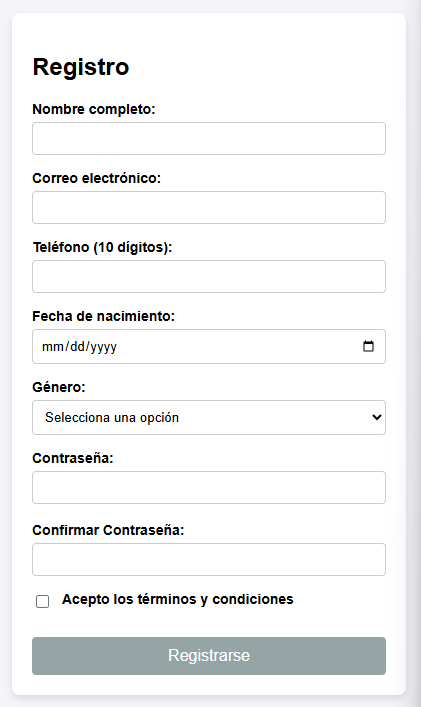

**Descripcion:** Vista inicial del formulario de registro. El formulario cuenta con 8 campos obligatorios. Se implementó el atributo `novalidate` en la etiqueta `<form>` para desactivar la validación por defecto del navegador y delegar esta tarea completamente a JavaScript. El botón de envío comienza deshabilitado.

Para este proyecto, se optó por una arquitectura basada en Vanilla JavaScript (sin frameworks), separando las responsabilidades en dos archivos principales: validacion.js para la lógica de negocio (expresiones regulares y algoritmos de validación) y app.js para la manipulación del DOM y la escucha de eventos. En el HTML, se implementó el atributo novalidate en la etiqueta `<form>` para anular la validación nativa del navegador, permitiendo un control absoluto y personalizado del flujo de validación a través de JavaScript.

### 2. Errores de validación
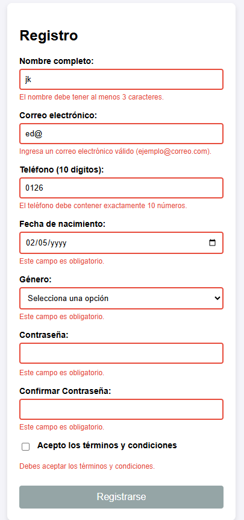

**Descripcion:** El sistema evalúa los campos mediante el evento `focusout`. Si los datos no cumplen con las expresiones regulares (regex) o si un campo obligatorio se deja vacío, el campo se marca con un borde rojo (`.invalido`) y se inyecta un mensaje de error específico en el DOM debajo del input correspondiente, evitando el uso de `alert()`.

La experiencia de usuario (UX) se mejoró implementando validación en tiempo real mediante eventos del DOM. Se utilizó focusout para evaluar los campos justo cuando el usuario termina de interactuar con ellos, evitando validaciones prematuras molestas. Para la corrección de errores, se escucha el evento input, el cual limpia las alertas visuales (clases .invalido) en el momento exacto en que el usuario comienza a modificar un campo erróneo. El feedback visual se gestiona inyectando dinámicamente clases CSS que modifican el borde de los inputs (verde para válido, rojo para inválido) y manipulando el textContent de etiquetas  dedicadas a los mensajes de error.

### 3. Campos válidos
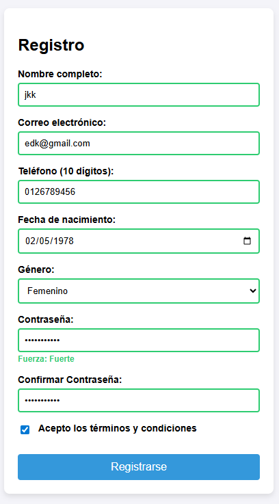

**Descripcion:** Validación exitosa mediante retroalimentación visual en tiempo real. Al comenzar a escribir (evento `input`), se limpian los errores. Si el dato ingresado pasa la prueba de validación (por ejemplo, el correo tiene un formato válido o el teléfono tiene 10 dígitos), el campo adquiere un borde verde (`.valido`).

Para garantizar la integridad de los datos, se implementaron validaciones estrictas utilizando Expresiones Regulares (Regex). Se definieron patrones específicos para asegurar que el nombre solo contenga letras y espacios, que el teléfono sea estrictamente de 10 dígitos numéricos (/^\d{10}$/), y que el formato del correo electrónico cumpla con el estándar (presencia de @ y dominio). Estas expresiones se evalúan mediante el método .test(), el cual retorna un booleano que determina si el flujo de validación debe detenerse y mostrar un error, o continuar.

### 4. Fuerza de contraseña
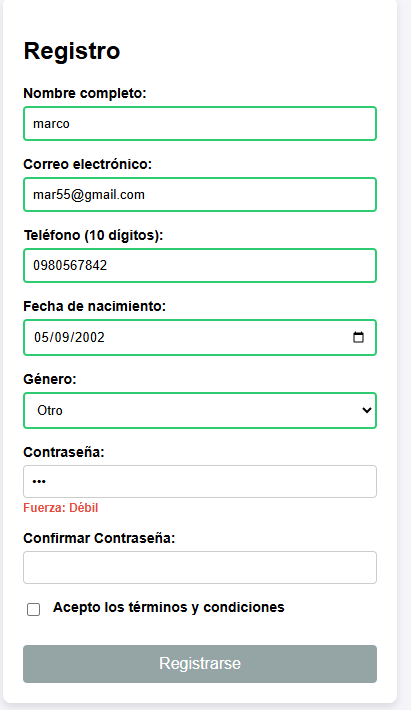
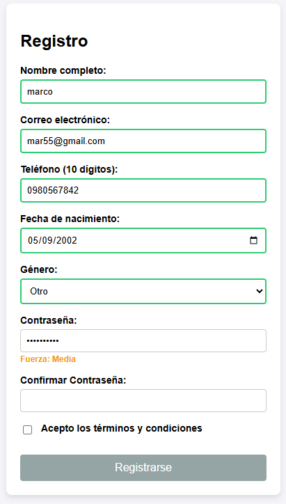
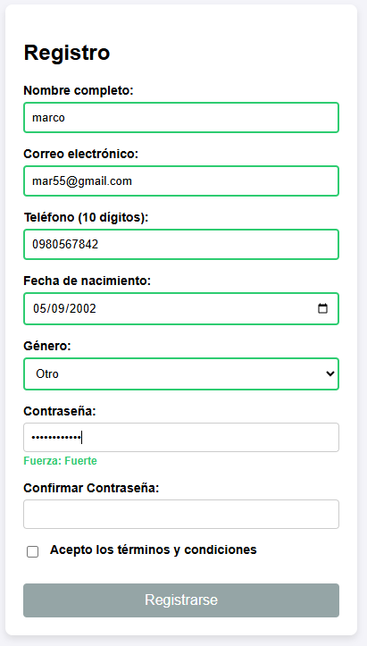

**Descripcion:** Indicador dinámico del nivel de seguridad de la contraseña. La función evalúa en tiempo real si la cadena contiene letras minúsculas, mayúsculas, números y al menos 8 caracteres. Dependiendo de cuántas reglas se cumplan, el indicador cambia su texto y color a Débil (Rojo), Media (Naranja) o Fuerte (Verde).

Se desarrolló un algoritmo secuencial para medir la entropía (fuerza) de la contraseña. El script evalúa cuatro condiciones mediante Regex: presencia de minúsculas, mayúsculas, números y una longitud mínima de 8 caracteres. Dependiendo de los criterios cumplidos, el DOM se actualiza en tiempo real mostrando niveles de seguridad (Débil, Media, Fuerte) con sus respectivos códigos de color. Adicionalmente, se implementó una validación cruzada estricta para el campo "Confirmar Contraseña", la cual compara en tiempo real el valor de ambos inputs y bloquea el registro si no son estrictamente idénticos.

### 5. Confirmación password
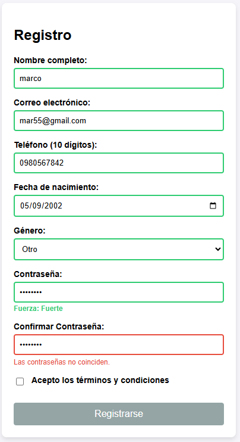

**Descripcion:** Validación cruzada entre dos campos. Al perder el foco o escribir en el campo de confirmación, el script compara su valor directamente con el valor actual del campo original de contraseña. Si no son exactamente iguales, se activa la alerta visual de error.

El evento submit del formulario fue interceptado utilizando e.preventDefault() para evitar la recarga sincrona de la página. Una vez que la función validarFormulario() confirma que no hay clases .invalido ni campos vacíos, se procede a la extracción de datos. Para esto, se utilizó la API moderna FormData combinada con Object.fromEntries(), lo que permite serializar todos los inputs del formulario en un objeto JSON limpio. Dado que FormData omite por defecto los checkboxes no marcados, se implementó una captura manual del estado del campo de "Términos y condiciones" antes de imprimir el objeto final en la consola y resetear el DOM.

### 6. Envío exitoso
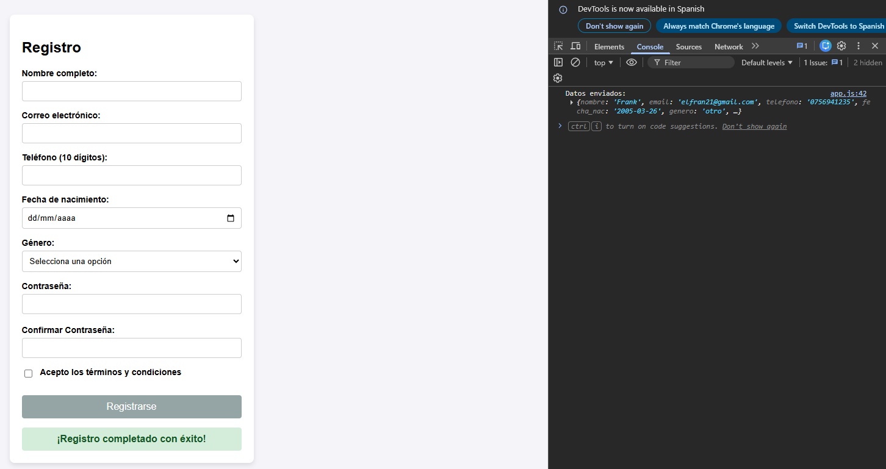

**Descripcion:** Intercepción del evento `submit`. Se utiliza `e.preventDefault()` para evitar la recarga de la página. Tras verificar que no hay errores, los datos se recolectan limpiamente utilizando `FormData` y `Object.fromEntries()`. Se captura manualmente el estado del checkbox de términos. Finalmente, se muestra un mensaje de éxito, se imprime el objeto con los datos en la consola y se resetea el formulario.

Como capa adicional de prevención de errores, se desarrolló la función actualizarEstadoBoton(). Esta función se dispara cada vez que ocurre un evento input, focusout o change. Su lógica itera sobre todos los elementos del formulario (querySelectorAll) verificando dos banderas booleanas: que todos los campos requeridos tengan valor (incluyendo el estado checked del checkbox) y que ningún elemento contenga la clase de error. El botón de envío (btnSubmit) permanece con el atributo disabled en true hasta que ambas condiciones se cumplen, guiando al usuario hacia un envío exitoso garantizado.

### 7. Funcionalidad extra: Botón condicional
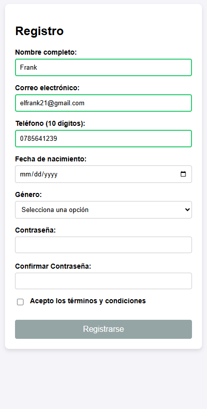
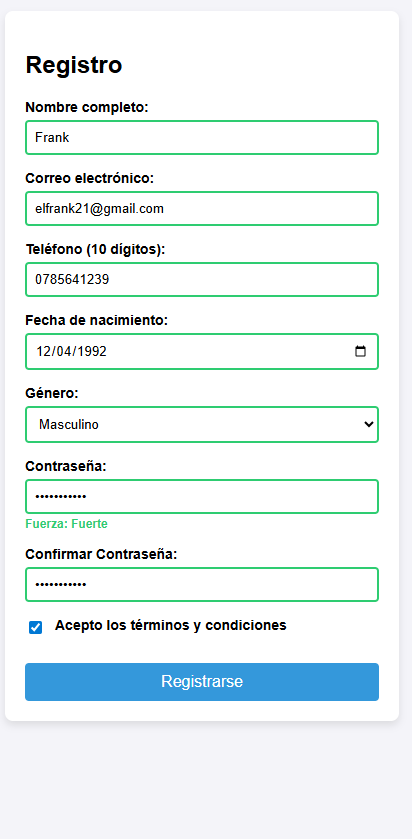

**Descripcion:** Se implementó la habilitación/deshabilitación dinámica del botón de envío. Una función (`actualizarEstadoBoton()`) recorre todos los inputs verificando que ninguno esté vacío, que el checkbox esté marcado y que ningún elemento tenga la clase `.invalido`. El botón solo pasa a estar activo (azul) cuando todo el formulario es 100% válido.

Como capa adicional de mejora en la Experiencia de Usuario (UX) y prevención de fallos, se desarrolló la función actualizarEstadoBoton(). Este algoritmo actúa como un validador de estado global del formulario. Cada vez que se dispara un evento de interacción, la función itera sobre un NodeList de todos los inputs capturados mediante querySelectorAll. Durante el ciclo, evalúa dos condiciones booleanas concurrentes: primero, que todos los campos requeridos contengan un valor (incluyendo la validación de la propiedad .checked para el checkbox de términos); y segundo, que ningún elemento en el DOM posea la clase .invalido. Únicamente cuando el estado de ambas condiciones es positivo, el script manipula dinámicamente el DOM para remover el atributo disabled del btnSubmit, garantizando que solo se envíen peticiones estructuradas correctamente.

### 8. Código - Lógica de Validación
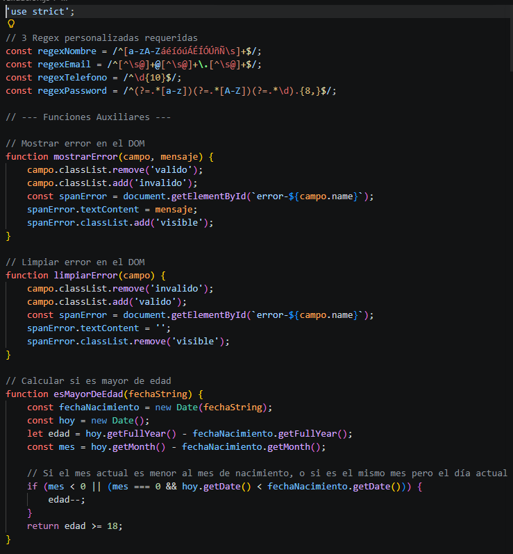
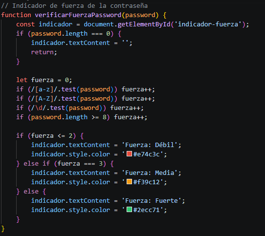
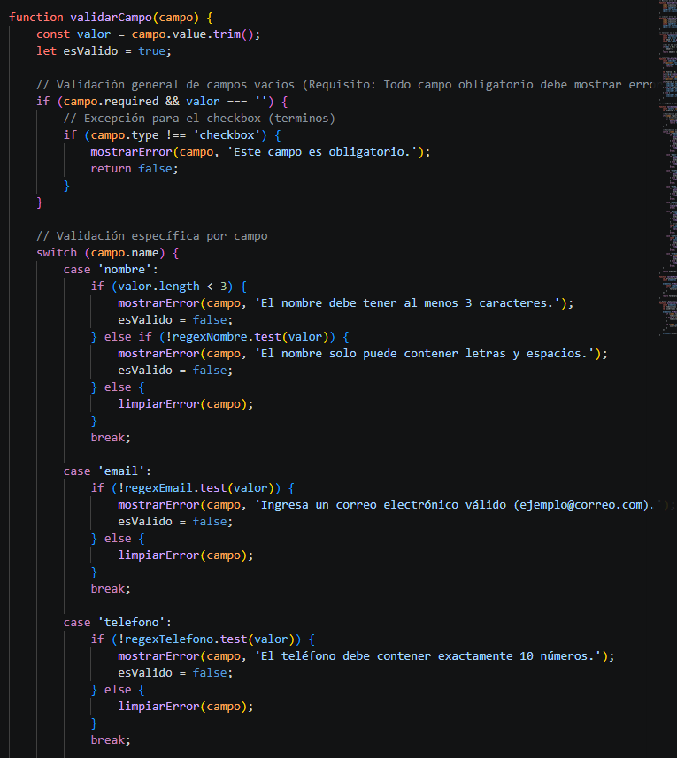
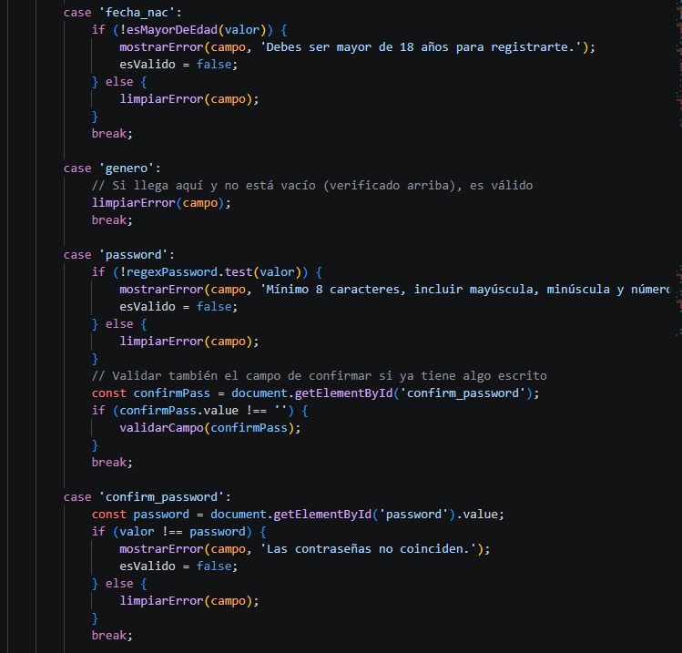
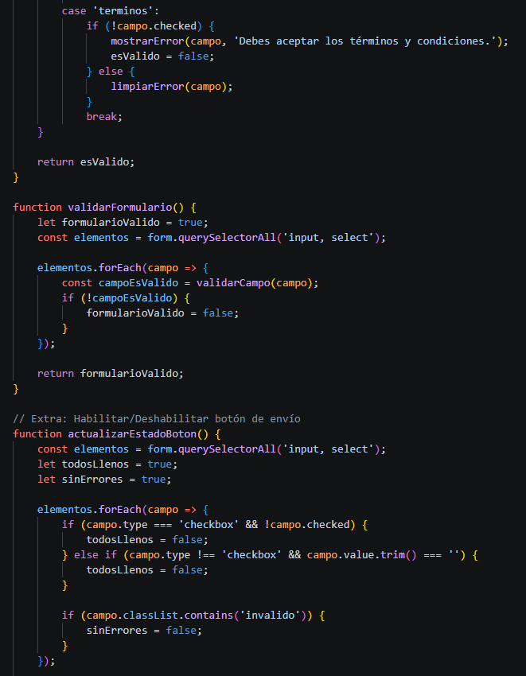
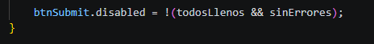

**Descripcion:** Capturas del archivo `validacion.js`. Aquí se define la lógica central de la práctica: expresiones regulares, funciones auxiliares para manipular clases del DOM, el algoritmo para calcular la mayoría de edad y el bloque `switch` encargado de validar individualmente cada tipo de input según su atributo `name`.

El archivo validacion.js fue estructurado bajo el principio de separación de responsabilidades (Separation of Concerns), encapsulando de manera aislada toda la lógica de negocio del formulario. Este módulo centraliza las constantes de expresiones regulares y alberga algoritmos complejos, como la función esMayorDeEdad, la cual calcula la edad precisa mediante el uso del objeto Date de JavaScript, considerando el desfase de meses y días. La validación se canaliza a través de un controlador principal (validarCampo) que utiliza una estructura de control switch-case atada al atributo name de cada nodo HTML. Este enfoque modular permite aplicar reglas de evaluación únicas por tipo de dato, mutar el DOM a través de funciones auxiliares (mostrarError / limpiarError) y retornar el estado booleano de la operación al controlador de eventos.

### 9. Código - Manejo de Eventos (App)
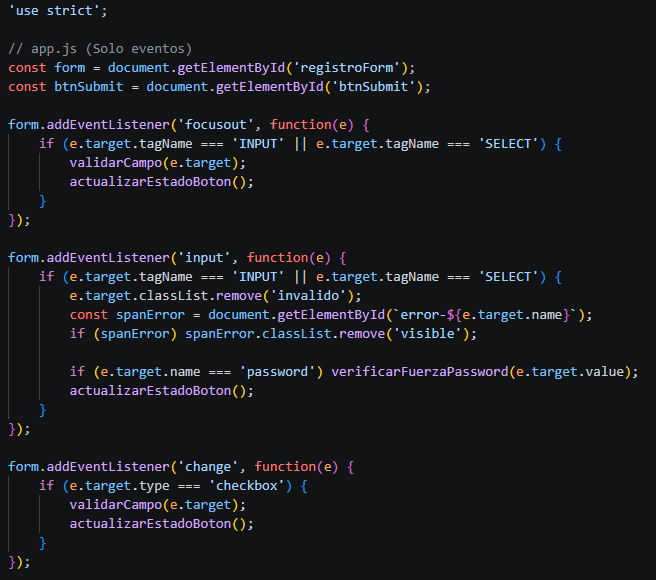
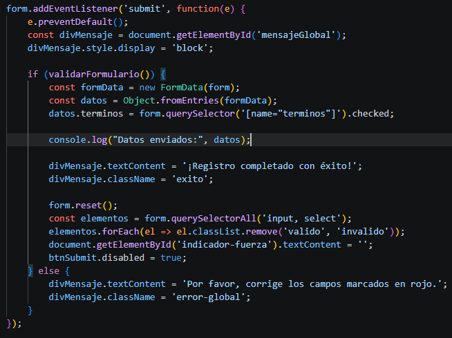

**Descripcion:** Capturas del archivo `app.js`. Este archivo ilustra el principio de separación de responsabilidades. Contiene los "event listeners" que vigilan la interacción del usuario (`focusout`, `input`, `change`, `submit`) y conectan la interfaz HTML con la lógica de validación definida en el otro archivo, manejando también la recopilación y envío final de los datos.

El archivo app.js opera como el controlador de interacciones de la aplicación. Su función exclusiva es inicializar los Event Listeners y servir como puente entre la interfaz de usuario y las funciones puras del archivo de validación. Implementa escuchadores asíncronos para capturar el ciclo de vida de la escritura: focusout para ejecutar la validación al abandonar el target, e input para proveer retroalimentación visual progresiva y limpiar los mensajes de error en tiempo real. Finalmente, intercepta la propagación del evento submit aplicando un método preventDefault() estricto. Tras aprobar el flujo de validación global, este archivo maneja la recolección y estructuración de los datos en formato JSON mediante la API nativa FormData y Object.fromEntries(), concluyendo con el reseteo del árbol del DOM mediante form.reset().

---

## Conclusiones
El desarrollo de este proyecto demuestra la capacidad de crear interfaces robustas y seguras utilizando únicamente los estándares web nativos. Las principales conclusiones técnicas y arquitectónicas son:

* **Separación de Responsabilidades (SoC):** Dividir la lógica matemática y de validación (`validacion.js`) de la orquestación del DOM y los eventos (`app.js`) resulta en un ecosistema de código más limpio, escalable y modular.
* **Optimización de la UX:** La validación asíncrona o en tiempo real (delegada a eventos como `input` y `focusout`) reduce drásticamente la tasa de error del usuario, guiándolo visualmente para corregir sus datos en el momento exacto, en lugar de obligarlo a esperar al envío del formulario para descubrir los fallos.
* **Eficacia de las Expresiones Regulares (Regex):** Queda comprobado que las Regex son herramientas indispensables en el *frontend* para parsear y validar patrones de texto complejos (como correos electrónicos y reglas de entropía en contraseñas) con un costo computacional mínimo.
* **Estrategia de Prevención de Errores:** La técnica de mantener el botón de acción principal (`submit`) en estado *disabled* hasta que la estructura de datos sea 100% válida actúa como un mecanismo *Poka-yoke* (a prueba de errores), evitando peticiones malformadas o innecesarias al servidor.

---

## Bibliografía

* Red de Desarrolladores de Mozilla (MDN Web Docs). (s.f.). *FormData*. Recuperado de: 
[https://developer.mozilla.org/es/docs/Web/API/FormData](https://developer.mozilla.org/es/docs/Web/API/FormData)

* Red de Desarrolladores de Mozilla (MDN Web Docs). (s.f.). *Expresiones Regulares*. Recuperado de: 
[https://developer.mozilla.org/es/docs/Web/JavaScript/Guide/Regular_expressions](https://developer.mozilla.org/es/docs/Web/JavaScript/Guide/Regular_expressions)